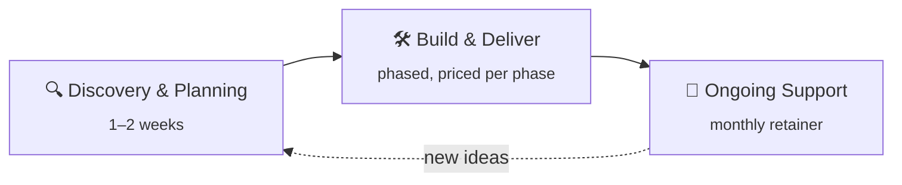

<!-- Banner -->

  

<!-- Typing line -->

  

<!-- Badges -->

  
  
  
  
  

---

### We find the process that's quietly costing your team hours a week, automate it end to end, and stay on the hook for it.

Islamabad-based engineering team building software, AI and data systems for businesses and public-sector teams who need them to **actually work in production**, not just in a demo.

<!-- Numbers -->
<table align="center">
  <tr>
    <td align="center" width="25%"><h2>250+</h2>mall tenants billed automatically</td>
    <td align="center" width="25%"><h2>400K+</h2>company files answerable by a private AI</td>
    <td align="center" width="25%"><h2>200K+</h2>CVE records searchable in under 50 ms</td>
    <td align="center" width="25%"><h2>80+</h2>threat intel feeds scored daily</td>
  </tr>
</table>

## ⚡ What we build

<table>
  <tr>
    <td width="50%" valign="top">
      <h3>🧱 Software development</h3>
      Web apps, SaaS platforms, customer portals, internal tools, APIs and integrations, from requirements to deployment.
    </td>
    <td width="50%" valign="top">
      <h3>🧠 AI solutions</h3>
      AI assistants, LLM features, document processing, RAG knowledge systems and agents, including fully self-hosted models when data can't leave the building.
    </td>
  </tr>
  <tr>
    <td valign="top">
      <h3>⚙️ Business automation</h3>
      Billing, reporting and approval workflows that run on their own, with humans in the loop where it matters.
    </td>
    <td valign="top">
      <h3>📊 Data analytics</h3>
      Pipelines, warehouses, BI dashboards and predictive models that turn scattered data into decisions.
    </td>
  </tr>
  <tr>
    <td colspan="2" valign="top">
      <h3>🛡️ Cyber security</h3>
      Penetration testing, SIEM &amp; UEBA, threat intelligence and vulnerability platforms, built for teams whose job is defence.
    </td>
  </tr>
</table>

## 🚀 Selected work

<table>
  <tr>
    <td width="50%" valign="top">
      
      <h4><a href="https://boltertech.com/en/work/current-by-logmate">Current by Logmate</a></h4>
      Automated electricity billing and payment recovery for commercial malls. <b>Live platform.</b>
    </td>
    <td width="50%" valign="top">
      
      <h4><a href="https://boltertech.com/en/work/bolter-siem">Bolter SIEM</a></h4>
      SOC monitoring and UEBA analytics correlating 1M+ events per second.
    </td>
  </tr>
  <tr>
    <td valign="top">
      
      <h4><a href="https://boltertech.com/en/work/pknvd">PKNVD</a></h4>
      National vulnerability database: 200K+ CVEs with live exploit intelligence.
    </td>
    <td valign="top">
      
      <h4><a href="https://boltertech.com/en/work/psx-portfolio-tracker">PSX Portfolio Tracker</a></h4>
      Live Pakistan Stock Exchange prices and dividends in one dashboard. <b>Live app.</b>
    </td>
  </tr>
</table>

<a href="https://boltertech.com/en/work"><b>See all 15 case studies →</b></a>

## 🧰 Our stack

  

Plus llama.cpp · LangChain · pgvector · Whisper · Elasticsearch · self-hosted and API LLMs

## 🔁 How we work

<b>What you can hold us to</b>

 

- **One named point of contact:** you always know who to call.
- **Clear pricing by phase:** you know the cost before each phase starts. No surprise invoices.
- **You own what we build:** code, designs and docs are yours.
- **Support beyond delivery:** a proper handover, and we stay on if you need us.

---

  <b>Have a process that's eating your team's week?</b>  
  

📍 Islamabad, Pakistan · 📧 contact@boltertech.com

